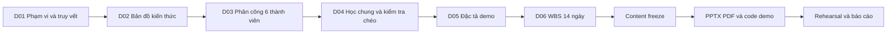

# Parallel and Distributed Computing

## Chương 4 — Phương pháp tính toán bất đồng bộ trong Python

| Thuộc tính dự án | Giá trị |
|---|---|
| Nhóm thực hiện | 6 thành viên |
| Mục tiêu | Nghiên cứu, giảng giải và kiểm chứng toàn bộ Chương 4 |
| Phạm vi kỹ thuật | Nền tảng concurrency/asynchrony, `concurrent.futures`, `asyncio`, reliability, performance và kiến trúc lai |
| Cấu hình trình bày | 48 slide chuẩn hoặc 36 slide rút gọn; 18 slide phụ lục |
| Demo | Trung tâm giám sát nhiều trạm cảm biến, 5 chế độ thực thi |
| Mô hình trách nhiệm | Owner chuyên môn + reviewer/backup + chuẩn kiến thức chung |
| Baseline khối lượng | 100 điểm, 48 giờ dự kiến và 8 work package/người |
| Phạm vi release hiện tại | Hồ sơ dự án, kiến thức, phân công, đào tạo, demo specification và WBS |

Repository là không gian điều hành duy nhất cho dự án báo cáo Chương 4. Phạm vi, nội dung, nhiệm vụ, nguồn, review, demo và tiêu chí nghiệm thu đều được quản lý bằng tài liệu có mã, GitHub Issue và Pull Request.

---

## 1. Luồng thực hiện



Mỗi giai đoạn có đầu vào, sản phẩm bàn giao và cổng phê duyệt. Artifact của giai đoạn sau chỉ được tạo khi cổng tương ứng trong D01 đã đóng.

## 2. Bộ hồ sơ chính thức

Đọc theo thứ tự sau:

| Mã | Tài liệu | Mục đích sử dụng |
|---|---|---|
| D01 | [`00_HO_SO_DU_AN_VA_MA_TRAN_TRUY_VET.md`](docs/00_HO_SO_DU_AN_VA_MA_TRAN_TRUY_VET.md) | Project charter, phạm vi, 24 requirement nguồn, 12 requirement mở rộng và quality gates |
| D02 | [`01_BAN_DO_KIEN_THUC_A_Z.md`](docs/01_BAN_DO_KIEN_THUC_A_Z.md) | Nền kiến thức Core/Applied/Advanced, semantics, version matrix, bẫy và nguồn chính thức |
| D03 | [`02_PHAN_CONG_6_THANH_VIEN_A_Z.md`](docs/02_PHAN_CONG_6_THANH_VIEN_A_Z.md) | Nội dung từng slide, nhiệm vụ, đầu ra, câu hỏi, owner/backup và tiêu chí hoàn thành |
| D04 | [`03_CHUONG_TRINH_HOC_CHUNG_VA_KIEM_TRA_CHEO.md`](docs/03_CHUONG_TRINH_HOC_CHUNG_VA_KIEM_TRA_CHEO.md) | 40 năng lực chung, 8 buổi học, lab, quiz, oral defense và review chéo |
| D05 | [`04_DAC_TA_DEMO_THUC_TE_NHO.md`](docs/04_DAC_TA_DEMO_THUC_TE_NHO.md) | Data model, 5 mode, fault injection, test oracle, benchmark và runbook demo |
| D06 | [`05_KE_HOACH_THUC_HIEN_14_NGAY.md`](docs/05_KE_HOACH_THUC_HIEN_14_NGAY.md) | 48 work package, dependency, timeline, workload dashboard, risk register và bàn giao |

Không duy trì tài liệu trùng vai trò hoặc phân công song song trong nhánh chính. D01–D06 là nguồn sự thật duy nhất của dự án.

## 3. Kiến trúc nội dung và trách nhiệm

| Workstream | Owner | Backup | Slide chuẩn | Trọng tâm | Module demo |
|---|---:|---:|---:|---|---|
| WS-01 — Nền tảng và bản đồ khái niệm | TV1 | TV4 | 1–8 | Taxonomy, workload, scheduling, process/thread/coroutine | Data contract và sequential baseline |
| WS-02 — Future, Executor và ThreadPool | TV2 | TV5 | 9–16 | Future lifecycle, API semantics, error/cancel/deadlock | Blocking adapter và thread mode |
| WS-03 — ProcessPool, GIL và hiệu năng | TV3 | TV6 | 17–24 | Isolation, pickling/IPC, platform, benchmark | CPU stage và process mode |
| WS-04 — Event loop, coroutine và Task | TV4 | TV1 | 25–32 | Runtime model, orchestration, structured concurrency | Async adapter và async mode |
| WS-05 — Điều phối, lỗi và độ tin cậy | TV5 | TV2 | 33–40 | Timeout, cancellation, primitives, Queue, shutdown | Backpressure và failure policy |
| WS-06 — Kiến trúc lai và quyết định | TV6 | TV3 | 41–48 | Decision tree, hybrid, resource budget, distributed boundary | Hybrid mode và integration contract |

Owner chịu trách nhiệm chiều sâu và độ chính xác. Backup review, chạy lại bằng chứng và trình bày thay được. Bốn thành viên còn lại vẫn phải đạt toàn bộ 40 năng lực chung.

## 4. Baseline khối lượng đồng đều

| Gói việc/người | Điểm | Giờ dự kiến | Bằng chứng |
|---|---:|---:|---|
| Phạm vi và prerequisite | 8 | 4 | Requirement map và prerequisite map |
| Nghiên cứu chuyên sâu | 20 | 10 | 4.500–5.500 từ, tối thiểu 5 nguồn |
| Sơ đồ, bảng và ví dụ | 12 | 6 | 3 tài sản, 2 ví dụ đúng, 2 phản ví dụ |
| Slide và kịch bản nói | 15 | 7 | 8 slide chuẩn, mapping 6 slide rút gọn, 3 phụ lục |
| Demo và kiểm thử | 15 | 7 | 1 module, 6 loại test, 1 fault, 1 metric |
| Câu hỏi và teach-back | 10 | 5 | 20 câu có đáp án, teach-back 30 phút |
| Review và backup | 10 | 5 | 2 PR review, backup rehearsal |
| GitHub và rehearsal | 10 | 4 | Issue, branch, commit, PR, timing và workload log |
| **Tổng/người** | **100** | **48** | **8 work package hoàn chỉnh** |

Workload được cập nhật theo ngày trong D06. Chênh lệch dự kiến trên 5% phải có lý do; chênh lệch thực tế trên 10% kích hoạt tái phân bổ task độc lập.

## 5. Chuẩn kiến thức chung

Mỗi thành viên phải đạt bốn mức năng lực:

1. **Nhận biết:** định nghĩa đúng và phân biệt được các khái niệm gần nhau.
2. **Giải thích:** tự vẽ timeline, state diagram và luồng điều khiển.
3. **Áp dụng:** đọc, chạy, dự đoán và sửa được ví dụ.
4. **Phân tích:** chọn mô hình, nêu trade-off, giới hạn và phản biện kết quả.

Điều kiện tối thiểu:

- quiz chung từ 85%; không cụm Core nào dưới 70%;
- trả lời được câu ngẫu nhiên ngoài workstream chính;
- trình bày thay được phần của backup pair;
- chạy và giải thích được cả năm mode demo;
- sửa được ít nhất một fault ngoài module sở hữu;
- bảo vệ được nguồn, phiên bản và giới hạn của mọi claim chính.

## 6. Kiến trúc trình bày

| Cấu hình | Quy mô | Thời lượng nội dung | Demo và Q&A | Phạm vi sử dụng |
|---|---:|---:|---:|---|
| Rút gọn | 36 slide, 6/người | 30–36 phút | 16–20 phút | Thời lượng lớp hạn chế |
| Chuẩn | 48 slide, 8/người | 48–55 phút | 18–20 phút | Trình bày đầy đủ mạch Core và Applied |
| Phụ lục | 18 slide, 3/người | Theo Q&A | Không tính vào mạch chính | API matrix, version caveat, phản ví dụ và câu khó |

Mỗi slide có một thông điệp chính, một bằng chứng trực quan và speaker notes. Chi tiết dài nằm trong D02, speaker notes hoặc phụ lục; không đưa nguyên đoạn văn lên mặt slide.

## 7. Demo kiểm chứng

### Bài toán

Trung tâm thu thập dữ liệu từ nhiều trạm cảm biến có độ trễ và lỗi khác nhau, sau đó kiểm tra dữ liệu, thực hiện bước phân tích CPU và tổng hợp cảnh báo.

```text
Trạm cảm biến
  → lấy dữ liệu có độ trễ/lỗi
  → giới hạn số thao tác đang bay
  → bounded Queue tạo backpressure
  → kiểm tra và làm sạch
  → phân tích CPU
  → tổng hợp cảnh báo
  → metric và báo cáo
```

### Năm chế độ thực thi

| Mode | Mục đích |
|---|---|
| `sequential` | Oracle tính đúng và baseline |
| `thread` | Bao bọc blocking I/O bằng `ThreadPoolExecutor` |
| `process` | Thực hiện CPU-bound đủ lớn bằng `ProcessPoolExecutor` |
| `async` | Chồng thời gian chờ I/O bằng coroutine và Task |
| `hybrid` | `asyncio` cho I/O kết hợp process pool cho CPU |

Demo phải dùng cùng input/seed, kiểm tra output trước benchmark, chạy offline và lưu raw result. Kết luận hiệu năng phải gắn với cấu hình, workload và giới hạn phép đo.

## 8. Milestone và trạng thái

| Milestone | Sản phẩm | Trạng thái khởi tạo |
|---|---|---|
| MS-01 — Project charter | D01 và requirement matrix | Hoàn chỉnh cấu trúc |
| MS-02 — Knowledge baseline | D02 và source/version matrix | Hoàn chỉnh cấu trúc |
| MS-03 — Work allocation | D03 và WBS D06 | Hoàn chỉnh cấu trúc |
| MS-04 — Learning validation | D04, quiz, lab và oral records | Chờ gán thành viên |
| MS-05 — Demo specification | D05, interface và test matrix | Hoàn chỉnh đặc tả |
| MS-06 — Content freeze | Sáu hồ sơ chuyên môn và review | Chờ thực hiện |
| MS-07 — Production | Code demo, PPTX/PDF và notes | Ngoài release hiện tại |
| MS-08 — Rehearsal/release | Timing, fallback, Q&A và tag | Chờ MS-07 |

## 9. Quy trình GitHub

```text
Requirement
  → Work package
  → GitHub Issue
  → Branch tvN/ten-cong-viec
  → Commit nhỏ có ý nghĩa
  → Pull Request theo template
  → Backup review + review chéo chuyên môn
  → Rework
  → Merge
  → Cập nhật traceability và workload
```

Quy tắc bắt buộc:

- không sửa trực tiếp `main` trong giai đoạn nhóm thực hiện;
- mỗi PR liên kết Work Package ID và Requirement ID;
- claim kỹ thuật có nguồn, phiên bản và cách kiểm chứng;
- claim hiệu năng có input, môi trường, tham số, raw result và oracle;
- quyết định thay đổi phạm vi được ghi trong Issue;
- tài liệu nguồn chưa được phép công khai không được commit vào repository.

Mẫu thao tác nằm tại:

- [Issue template](.github/ISSUE_TEMPLATE/cong-viec-thanh-vien.md)
- [Pull Request template](.github/pull_request_template.md)

## 10. Điểm bắt đầu cho nhóm

1. Điền họ tên và MSSV vào TV1–TV6.
2. Xác nhận owner/backup theo WS-01…WS-06.
3. Chốt thời lượng báo cáo và phiên bản Python mục tiêu.
4. Tạo một Issue cho từng work package trong D06.
5. Thực hiện D−14 đến D−11: diagnostic, scope, source và hồ sơ chuyên môn.
6. Chỉ mở công việc PPTX/PDF hoặc code demo sau khi gate tương ứng được phê duyệt.

## 11. Nguồn và chuẩn chất lượng

Nguồn ưu tiên:

1. Tài liệu Chương 4 do giảng viên cung cấp để xác định phạm vi.
2. Python Language Reference, Standard Library documentation và PEP.
3. Tài liệu chính thức của dependency nếu demo sử dụng thư viện ngoài.
4. Tài liệu học thuật bổ trợ cho mô hình, benchmark và hệ thống phân tán.

Repository công khai chỉ chứa nội dung do nhóm xây dựng và liên kết nguồn. Mọi ví dụ phải được chạy, giải thích và kiểm tra giới hạn; không sao chép nguyên khối slide, mã hoặc tài liệu không có quyền phân phối.
