# HỒ SƠ DỰ ÁN VÀ MA TRẬN TRUY VẾT — CHƯƠNG 4

| Thuộc tính | Giá trị |
|---|---|
| Học phần | Tính toán song song và phân tán |
| Chuyên đề | Chương 4 — Phương pháp tính toán bất đồng bộ trong Python |
| Quy mô nhóm | 6 thành viên |
| Mô hình tổ chức | Owner chuyên môn + reviewer/backup + học chung toàn chương |
| Nguồn phạm vi | Tài liệu Chương 4 gồm 24 trang do giảng viên cung cấp |
| Cấu hình trình bày | 48 slide chuẩn hoặc 36 slide rút gọn; 18 slide phụ lục |
| Sản phẩm minh họa | Demo giám sát nhiều trạm cảm biến, gồm 5 chế độ thực thi |
| Trạng thái phát hành | Hồ sơ phạm vi, kiến thức, phân công, đào tạo và đặc tả demo |
| Ngoài phạm vi phát hành hiện tại | PPTX, PDF trình chiếu và mã nguồn demo |

---

## 1. Tuyên ngôn dự án

Dự án xây dựng một bộ hồ sơ học thuật và kế hoạch thực thi hoàn chỉnh cho Chương 4. Toàn bộ nội dung phải nối được bốn lớp:

1. **Nền tảng:** tuần tự, đồng thời, song song, bất đồng bộ, blocking/non-blocking và loại workload.
2. **Cơ chế Python:** Future, Executor, thread, process, coroutine, Task và event loop.
3. **Thiết kế tin cậy:** timeout, cancellation, exception, synchronization, Queue, backpressure và shutdown.
4. **Kiểm chứng:** demo, test oracle, fault injection, benchmark, review chéo và bảo vệ miệng.

Kết quả cuối cùng không chỉ là một bộ slide. Nhóm phải tạo được bằng chứng cho thấy sáu thành viên đều hiểu toàn bộ chương, đồng thời mỗi người sở hữu một cụm chuyên môn đủ sâu để chịu phản biện.

## 2. Mục tiêu và chỉ số thành công

| Mã | Mục tiêu | Chỉ số nghiệm thu |
|---|---|---|
| OBJ-01 | Bao phủ đầy đủ tài liệu nguồn | 22 trang kỹ thuật từ trang 2–23 đều có requirement ID, owner, slide và bằng chứng |
| OBJ-02 | Bảo đảm tính đúng kỹ thuật | Mọi claim về API có nguồn, phiên bản và phạm vi áp dụng |
| OBJ-03 | Cân bằng khối lượng | TV1–TV6 cùng định mức 100 điểm và 48 giờ dự kiến |
| OBJ-04 | Bảo đảm hiểu biết chung | 6/6 thành viên đạt quiz từ 85%; không cụm Core nào dưới 70% |
| OBJ-05 | Gắn lý thuyết với thực nghiệm | Demo có 5 mode, output oracle, 6 loại test/owner và benchmark tái lập |
| OBJ-06 | Sẵn sàng trình bày | Owner và backup đều trình bày được; thời lượng nằm trong cấu hình đã chọn |
| OBJ-07 | Truy vết được trên GitHub | Mỗi thay đổi đi qua Issue → branch → commit → Pull Request → review |

## 3. Hệ thống tài liệu chính thức

| Mã | Tài liệu | Vai trò trong dự án | Người duy trì quy ước |
|---|---|---|---:|
| D00 | `README.md` | Bảng điều khiển, luồng thực hiện và trạng thái dự án | TV4 |
| D01 | `00_HO_SO_DU_AN_VA_MA_TRAN_TRUY_VET.md` | Phạm vi, yêu cầu, truy vết nguồn và cổng phê duyệt | TV1 |
| D02 | `01_BAN_DO_KIEN_THUC_A_Z.md` | Nguồn kiến thức kỹ thuật dùng chung | TV3 |
| D03 | `02_PHAN_CONG_6_THANH_VIEN_A_Z.md` | Work breakdown, slide, đầu ra và trách nhiệm cá nhân | TV1–TV6 theo workstream |
| D04 | `03_CHUONG_TRINH_HOC_CHUNG_VA_KIEM_TRA_CHEO.md` | Đào tạo nội bộ, quiz, lab, oral defense và review | TV5 |
| D05 | `04_DAC_TA_DEMO_THUC_TE_NHO.md` | Yêu cầu demo, test, benchmark và kịch bản trình diễn | TV2 |
| D06 | `05_KE_HOACH_THUC_HIEN_14_NGAY.md` | WBS vận hành, lịch, dependency và bàn giao | TV6 |

Người duy trì quy ước quản lý cấu trúc và tính nhất quán; nội dung chuyên môn vẫn do owner tương ứng chịu trách nhiệm. Mỗi vai trò điều phối được giới hạn theo định mức đã công bố trong D03.

## 4. Phạm vi

### 4.1. Phạm vi bắt buộc

- Toàn bộ chủ đề kỹ thuật của trang 2–23 trong tài liệu Chương 4.
- Nền tảng cần thiết để phân biệt đúng concurrency, parallelism, asynchrony và blocking.
- `concurrent.futures`, Executor, Future, ThreadPoolExecutor và ProcessPoolExecutor.
- Event-driven architecture, event loop, coroutine, awaitable, Task và `asyncio.Future`.
- Orchestration, timeout, cancellation, exception propagation và structured concurrency.
- Synchronization primitives, Queue, bounded concurrency và backpressure.
- Bridge giữa mã async với blocking I/O, thread và process.
- GIL, serialization, main guard, IPC, overhead và khác biệt nền tảng.
- Test, debug, logging, graceful shutdown và benchmark có kiểm soát.
- Demo nhỏ có đường thành công, partial failure, timeout, cancellation và phương án offline.

### 4.2. Phạm vi mở rộng có kiểm soát

- Async context manager, iterator, generator, streams và subprocess.
- `contextvars`, cross-thread bridge và low-level loop API.
- Free-threaded CPython, InterpreterPool và thay đổi API ở Python mới.
- Liên hệ với hệ thống phân tán ở mức failure model, retry và idempotency.

Các nội dung mở rộng được đặt trong phụ lục hoặc tài liệu học; chỉ đưa vào mạch chính khi phục vụ trực tiếp một yêu cầu Core.

### 4.3. Ngoài phạm vi

- Xây dựng hệ thống IoT sản xuất hoặc cụm phân tán nhiều máy.
- So sánh toàn bộ framework async của hệ sinh thái Python.
- Tuyên bố hiệu năng tổng quát từ một máy hoặc một lần chạy.
- Đăng công khai tài liệu nguồn của giảng viên khi chưa có quyền.
- Tạo PPTX/PDF hoặc triển khai demo trước khi các cổng nội dung tương ứng được duyệt.

## 5. Luồng dự án

```mermaid
flowchart LR
    A[Khóa phạm vi] --> B[Hoàn thiện nền kiến thức]
    B --> C[Phân công owner và backup]
    C --> D[Viết hồ sơ chuyên môn]
    D --> E[Review và teach-back]
    E --> F[Đặc tả rồi triển khai demo]
    F --> G[Kiểm thử và benchmark]
    G --> H[Đóng băng nội dung]
    H --> I[Thiết kế slide và speaker notes]
    I --> J[Rehearsal và bảo vệ chéo]
    J --> K[Báo cáo]
```

Một giai đoạn chỉ được mở khi cổng nghiệm thu của giai đoạn trước đã đạt. Thay đổi phạm vi sau khi đóng băng phải có Issue, lý do, tác động khối lượng và người phê duyệt.

## 6. Sáu workstream chuyên môn

| Mã | Workstream | Owner | Backup | Slide chuẩn | Sản phẩm chuyên môn chính |
|---|---|---:|---:|---:|---|
| WS-01 | Nền tảng và bản đồ khái niệm | TV1 | TV4 | 1–8 | Taxonomy, timeline, workload map, baseline |
| WS-02 | Future, Executor và ThreadPool | TV2 | TV5 | 9–16 | State machine, API semantics, error/cancel/deadlock |
| WS-03 | ProcessPool, GIL và hiệu năng | TV3 | TV6 | 17–24 | IPC/pickling, platform note, benchmark protocol |
| WS-04 | Event loop, coroutine và Task | TV4 | TV1 | 25–32 | Runtime model, scheduling trace, orchestration |
| WS-05 | Điều phối, lỗi và độ tin cậy | TV5 | TV2 | 33–40 | Timeout/cancel, primitives, Queue, shutdown |
| WS-06 | Kiến trúc lai, quyết định và liên hệ phân tán | TV6 | TV3 | 41–48 | Decision tree, hybrid architecture, kết luận |

## 7. Ma trận truy vết 24 trang nguồn

| Trang | Yêu cầu nguồn | Requirement ID | Owner/backup | Vị trí kế hoạch | Bằng chứng bắt buộc |
|---:|---|---|---|---|---|
| 1 | Mở đầu Chương 4 | SRC-01 | TV1/TV4 | Slide 1 | Mục tiêu, phạm vi và bản đồ chương |
| 2 | Tính toán tuần tự | SRC-02 | TV1/TV4 | Slide 1–2 | Timeline tuần tự và baseline |
| 3 | Khái niệm tính toán đồng thời | SRC-03 | TV1/TV4 | Slide 2–3 | Timeline interleaving và định nghĩa concurrency |
| 4 | Cơ chế/đặc điểm đồng thời | SRC-04 | TV1/TV4 | Slide 3–4 | Bảng process/thread/coroutine và context switch |
| 5 | Khái niệm tính toán song song | SRC-05 | TV1/TV3 | Slide 4–5, 17 | Điều kiện thực thi đồng thời vật lý và CPU-bound |
| 6 | Đặc điểm/so sánh song song | SRC-06 | TV3/TV6 | Slide 17–24 | GIL, process, overhead, speedup và giới hạn |
| 7 | Khái niệm tính toán bất đồng bộ | SRC-07 | TV1/TV4 | Slide 6–7 | Ma trận sync/async × blocking/non-blocking |
| 8 | Cách hoạt động bất đồng bộ | SRC-08 | TV4/TV1 | Slide 7–8, 25–28 | Timeline suspend/wait/ready/resume |
| 9 | Giới thiệu `concurrent.futures` | SRC-09 | TV2/TV5 | Slide 9 | Vai trò abstraction và tên module chính xác |
| 10 | Threading và multiprocessing backend | SRC-10 | TV2/TV3 | Slide 10, 13, 17–18 | Sơ đồ Executor với hai backend |
| 11 | Executor và hai loại pool | SRC-11 | TV2/TV5 | Slide 11–16 | `submit`, `map`, shutdown và context manager |
| 12 | Future API | SRC-12 | TV2/TV5 | Slide 10–12, 15 | State machine, result/exception/cancel/callback |
| 13 | Worker pool và tái sử dụng worker | SRC-13 | TV2/TV3 | Slide 13–16, 18 | Work queue, worker limit và lifecycle |
| 14 | Chi phí tạo worker và độ trễ | SRC-14 | TV3/TV6 | Slide 20–24 | Startup/IPC/serialization và benchmark thật |
| 15 | Lựa chọn và giới hạn pool | SRC-15 | TV2/TV3 | Slide 15–16, 19–24 | Deadlock pattern, pickling và main guard |
| 16 | Event source, handler và loop | SRC-16 | TV4/TV1 | Slide 25 | Sơ đồ event source → wait → ready queue → dispatch |
| 17 | Queue và dispatch của event loop | SRC-17 | TV4/TV1 | Slide 25, 28 | Cooperative scheduling và blocking anti-pattern |
| 18 | Tổng quan `asyncio` | SRC-18 | TV4/TV1 | Slide 25–26 | `asyncio.run`, phạm vi I/O concurrency |
| 19 | Event loop, coroutine, Future, Task | SRC-19 | TV4/TV1 | Slide 26–28 | Type relationship và hai họ Future |
| 20 | Coroutine | SRC-20 | TV4/TV1 | Slide 26, 28–29 | Function/object, awaitable và never-awaited |
| 21 | Nhiều coroutine/task | SRC-21 | TV4/TV5 | Slide 29–30, 33–36 | `gather`, `wait`, `TaskGroup`, error/cancel semantics |
| 22 | Điều phối nhiều tác vụ | SRC-22 | TV5/TV2 | Slide 33–40 | Timeout, cleanup, primitives, Queue và backpressure |
| 23 | Tổng kết chương | SRC-23 | TV6/TV3 | Slide 41–48 | Decision tree, demo evidence và kết luận có điều kiện |
| 24 | Kết thúc/tài liệu tham khảo | SRC-24 | TV3/TV6 | Phụ lục và References | Danh mục nguồn, phiên bản và bản quyền |

Mỗi requirement chỉ được đóng khi đồng thời có nội dung, nguồn, minh họa, owner xác nhận và reviewer ký duyệt. Việc xuất hiện một thuật ngữ trên slide chưa đủ để đóng requirement.

## 8. Yêu cầu bổ sung để hoàn thiện năng lực thực hành

| Mã | Yêu cầu mở rộng | Owner | Backup | Bằng chứng |
|---|---|---:|---:|---|
| EXT-01 | Phân biệt đầy đủ sequential/concurrent/parallel/async | TV1 | TV4 | Taxonomy, timeline và bài phân loại |
| EXT-02 | Correctness oracle và Amdahl/overhead nền | TV1 | TV4 | Baseline, digest và đồ thị lý thuyết |
| EXT-03 | Future/Executor lifecycle và collection order | TV2 | TV5 | State diagram, code đúng/sai và test |
| EXT-04 | Thread safety và pool deadlock | TV2 | TV5 | Wait-for graph và timeout-protected example |
| EXT-05 | GIL, pickling, IPC và platform caveat | TV3 | TV6 | Platform matrix và ProcessPool checklist |
| EXT-06 | Benchmark tái lập, speedup và efficiency | TV3 | TV6 | Protocol, raw schema và review số liệu |
| EXT-07 | Coroutine/Task/Future semantics | TV4 | TV1 | Type map và scheduling trace |
| EXT-08 | Structured concurrency và orchestration | TV4 | TV1 | Bảng `gather`/`wait`/`TaskGroup` |
| EXT-09 | Timeout, cancellation, cleanup và shutdown | TV5 | TV2 | State/sequence diagram và fault tests |
| EXT-10 | Synchronization, Queue và backpressure | TV5 | TV2 | Primitive table và bounded-pipeline test |
| EXT-11 | Hybrid architecture và resource budget | TV6 | TV3 | Architecture diagram và decision matrix |
| EXT-12 | Ranh giới async–distributed và giới hạn suy diễn | TV6 | TV3 | Failure-model table và kết luận demo |

## 9. Cổng phê duyệt

| Gate | Điều kiện mở | Điều kiện đóng | Sản phẩm được phép bắt đầu tiếp theo |
|---|---|---|---|
| G0 — Khởi tạo | Xác nhận nhóm 6 người | Điền tên/MSSV, owner, backup và deadline | Nghiên cứu |
| G1 — Phạm vi | D01 hoàn chỉnh | SRC-01…SRC-24 có owner và vị trí | Hồ sơ chuyên môn |
| G2 — Kiến thức | D02 có Core/Applied/Advanced | Claim Core có nguồn và version | Outline slide |
| G3 — Phân công | D03 được nhóm ký duyệt | 6 gói 100 điểm/48 giờ, không task vô chủ | Thực hiện cá nhân |
| G4 — Học chéo | Teach-back, lab và quiz đã chạy | 6/6 đạt chuẩn điểm và oral defense | Đóng băng nội dung |
| G5 — Demo | D05 và test matrix được duyệt | Oracle, mode, fault, benchmark protocol hợp lệ | Cài đặt demo |
| G6 — Trình bày | Nội dung và demo qua review | Timing, backup, offline plan và Q&A đạt | Tạo PPTX/PDF |
| G7 — Phát hành | Rehearsal cuối hoàn tất | Tag/release chứa đúng artifact được duyệt | Báo cáo chính thức |

## 10. Kiểm soát thay đổi

Mọi thay đổi phạm vi, slide, API hoặc demo sau G3 phải có:

1. Issue ghi requirement bị tác động.
2. Lý do thay đổi và nguồn kỹ thuật.
3. Ước lượng điểm/giờ phát sinh.
4. Owner thực hiện và reviewer phê duyệt.
5. Quyết định giữ, thay thế, chuyển phụ lục hoặc loại bỏ.
6. Cập nhật ma trận truy vết, WBS và speaker notes liên quan.

Không chèn nội dung mới trực tiếp vào nhánh chính hoặc slide tổng mà không có traceability. Khi tải của một thành viên vượt ngưỡng, task độc lập phải được tách và tái phân bổ trước khi mở rộng phạm vi.

## 11. Tiêu chí phát hành hồ sơ dự án

- [ ] Không còn tài liệu trùng vai trò trong nhánh chính.
- [ ] README dẫn đúng một luồng đọc chính thức.
- [ ] 24 trang nguồn có requirement ID và owner.
- [ ] 12 yêu cầu mở rộng có owner/backup cân bằng.
- [ ] Sáu workstream khớp với 48 slide chuẩn và 18 slide phụ lục.
- [ ] Mọi thành viên có đúng một gói 100 điểm/48 giờ dự kiến.
- [ ] Các cổng phê duyệt có đầu vào, đầu ra và quyền mở giai đoạn tiếp theo.
- [ ] Không có tuyên bố hiệu năng hoặc phiên bản không kèm bằng chứng.
- [ ] Phạm vi phát hành hiện tại không chứa PPTX, PDF hoặc code demo chưa được duyệt.
