# KIẾN TRÚC PPT CUỐI CÙNG — CHƯƠNG 4

| Thuộc tính | Quy định chốt |
|---|---|
| Vai trò | Blueprint để chuyển hồ sơ dự án thành PPTX cuối cùng |
| Cấu hình chuẩn | 48 slide chính, 8 slide/TV, 48–55 phút nội dung |
| Cấu hình rút gọn | 36 slide chính, 6 slide/TV, 30–36 phút nội dung |
| Phụ lục | 18 slide, 3 slide/TV, chỉ mở khi Q&A hoặc giảng viên yêu cầu |
| Demo | 8–10 phút, tách khỏi 48 slide chính |
| Nguyên tắc thiết kế | Một thông điệp chính + một bằng chứng trực quan + một lời giải thích rõ trên mỗi slide |
| Trạng thái | Blueprint; chưa tạo PPTX/PDF |

---

## 1. Định nghĩa PPT cuối cùng

PPT cuối cùng là một câu chuyện thống nhất, đi theo tuyến:

```text
Bài toán thực tế
  → nhận diện workload và khái niệm
  → chọn cơ chế thực thi Python
  → tổ chức coroutine/Task hoặc Executor/Future
  → xử lý lỗi, timeout và quá tải
  → chọn kiến trúc phù hợp
  → chứng minh bằng demo, test và benchmark
```

**48 slide chính** là cấu hình chuẩn và là nguồn để rút thành bản 36 slide. Slide 1 đồng thời là bìa học thuật và câu hỏi trung tâm; slide 48 là tổng kết, điều hướng demo và Q&A. Không bổ sung slide “Cảm ơn” hoặc “Mục lục” đứng riêng vì làm lệch phân công 8 slide/người. Thông tin nhóm, môn học, giảng viên và ngày báo cáo đặt gọn trên slide 1; bản đồ chương đặt ở slide 8.

Mỗi slide phải trả lời được năm câu hỏi trước khi được đưa vào PPTX:

1. Người xem phải nhớ một ý nào sau slide này?
2. Bằng chứng trực quan nào làm rõ ý đó: timeline, state machine, bảng, code ngắn, biểu đồ hay sơ đồ kiến trúc?
3. Nội dung này dùng đúng thuật ngữ, phiên bản Python và nguồn chưa?
4. Người nói giải thích được trong khoảng một phút mà không đọc chữ trên slide không?
5. Slide này dẫn hợp lý sang slide kế tiếp hay không?

## 2. Sơ đồ cây — PPT cuối cùng và trách nhiệm sáu thành viên

```mermaid
flowchart TB
    ROOT["PPT CUỐI CÙNG<br/>Chương 4: Phương pháp tính toán bất đồng bộ<br/>48 slide chính · 18 phụ lục · demo 8–10 phút"]

    ROOT --> TV1["TV1 — Nền tảng và bản đồ khái niệm<br/>Slide 1–8"]
    ROOT --> TV2["TV2 — Future, Executor và ThreadPool<br/>Slide 9–16"]
    ROOT --> TV3["TV3 — ProcessPool, GIL và hiệu năng<br/>Slide 17–24"]
    ROOT --> TV4["TV4 — Event loop, coroutine và Task<br/>Slide 25–32"]
    ROOT --> TV5["TV5 — Điều phối, lỗi và độ tin cậy<br/>Slide 33–40"]
    ROOT --> TV6["TV6 — Kiến trúc lai, quyết định và kết luận<br/>Slide 41–48"]

    TV1 --> TV1A["Mạch kể: bài toán → khái niệm → workload"]
    TV1 --> TV1B["Tài sản: taxonomy, timeline, baseline"]
    TV1 --> TV1C["Demo: data contract + sequential oracle"]
    TV1 --> TV1D["Backup: TV4"]

    TV2 --> TV2A["Mạch kể: gửi việc → Future → ThreadPool"]
    TV2 --> TV2B["Tài sản: Future state, API matrix, order trace"]
    TV2 --> TV2C["Demo: blocking adapter + thread mode"]
    TV2 --> TV2D["Backup: TV5"]

    TV3 --> TV3A["Mạch kể: CPU-bound → ProcessPool → benchmark"]
    TV3 --> TV3B["Tài sản: IPC, pickling, speedup chart"]
    TV3 --> TV3C["Demo: CPU stage + process mode"]
    TV3 --> TV3D["Backup: TV6"]

    TV4 --> TV4A["Mạch kể: event loop → coroutine → TaskGroup"]
    TV4 --> TV4B["Tài sản: loop diagram, scheduling trace, type map"]
    TV4 --> TV4C["Demo: async adapter + async mode"]
    TV4 --> TV4D["Backup: TV1"]

    TV5 --> TV5A["Mạch kể: failure → timeout/cancel → backpressure"]
    TV5 --> TV5B["Tài sản: cancel state, primitive matrix, Queue flow"]
    TV5 --> TV5C["Demo: policy lỗi + bounded pipeline"]
    TV5 --> TV5D["Backup: TV2"]

    TV6 --> TV6A["Mạch kể: decision → hybrid → giới hạn suy diễn"]
    TV6 --> TV6B["Tài sản: decision tree, hybrid architecture, resource budget"]
    TV6 --> TV6C["Demo: integration contract + report/runbook"]
    TV6 --> TV6D["Backup: TV3"]

    classDef root fill:#0f2747,color:#ffffff,stroke:#0f2747,stroke-width:2px;
    classDef member fill:#dbeafe,color:#0f172a,stroke:#2563eb,stroke-width:1.5px;
    classDef work fill:#f8fafc,color:#1e293b,stroke:#94a3b8,stroke-width:1px;
    class ROOT root;
    class TV1,TV2,TV3,TV4,TV5,TV6 member;
    class TV1A,TV1B,TV1C,TV1D,TV2A,TV2B,TV2C,TV2D,TV3A,TV3B,TV3C,TV3D,TV4A,TV4B,TV4C,TV4D,TV5A,TV5B,TV5C,TV5D,TV6A,TV6B,TV6C,TV6D work;
```



Sơ đồ này là sơ đồ điều hành: nhánh của mỗi thành viên không chỉ là “phần nói”, mà gồm mạch kiến thức, tài sản trực quan, phần demo và người backup. Chủ sở hữu module tự sửa phần của mình khi tích hợp; TV6 quản lý integration contract nhưng không làm thay năm module còn lại.

## 3. Bản đồ sườn PPT chuẩn 48 slide

| Khối | Slide | Owner | Mục tiêu của khối | Sản phẩm kết thúc khối |
|---|---:|---:|---|---|
| I | 1–8 | TV1 | Tạo nền tảng để người nghe không nhầm các khái niệm và hiểu bài toán | Baseline + bản đồ chương |
| II | 9–16 | TV2 | Hiểu abstraction Future/Executor và chọn ThreadPool đúng | Mode thread có lifecycle an toàn |
| III | 17–24 | TV3 | Hiểu giới hạn CPU/GIL/process và đo hiệu năng đúng | Mode process + benchmark protocol |
| IV | 25–32 | TV4 | Hiểu event loop, coroutine, Task và orchestration | Mode async không block loop |
| V | 33–40 | TV5 | Thiết kế chương trình chịu lỗi, có giới hạn tải và shutdown sạch | Pipeline có failure policy |
| VI | 41–48 | TV6 | Chọn kiến trúc bằng trade-off, liên kết demo và kết luận đúng phạm vi | Decision framework + Q&A handoff |

### 3.1. Khối I — TV1: nền tảng và bài toán, slide 1–8

| Slide | Tiêu đề chốt | Nội dung phải có | Minh họa/bằng chứng bắt buộc |
|---:|---|---|---|
| 1 | Bài toán và câu hỏi trung tâm | Tên đề tài, môn học, nhóm, giảng viên, ngày; bài toán nhiều trạm cảm biến; câu hỏi chọn mô hình thực thi | Sơ đồ pipeline cảm biến tối giản; không quá 3 mục thông tin hành chính |
| 2 | Tuần tự, đồng thời và song song | Ba khái niệm theo trục thời gian và tài nguyên; không đồng nhất concurrency với parallelism | Ba timeline cùng một workload |
| 3 | Đồng bộ, bất đồng bộ, blocking và non-blocking | Hai trục độc lập; ví dụ đúng và phản ví dụ | Ma trận 2×2 có tình huống Python |
| 4 | Process, thread, coroutine và scheduler | Đơn vị thực thi, bộ nhớ, scheduler, chi phí chuyển đổi và rủi ro chia sẻ state | Bảng so sánh đúng tầng trừu tượng |
| 5 | I/O-bound, CPU-bound và mixed workload | Cách nhận diện nút thắt; tại sao lựa chọn công cụ phụ thuộc workload | Workload classifier/decision mini-tree |
| 6 | Đo đúng trước khi kết luận | Correctness oracle, latency, throughput, environment, repeat và median | Checklist benchmark tái lập |
| 7 | Giới hạn tăng tốc và ngộ nhận | Overhead, Amdahl, worker/task nhiều hơn không luôn nhanh hơn | Đường cong speedup hoặc sơ đồ Amdahl |
| 8 | Baseline demo và bản đồ Chương 4 | Sequential baseline, fixed seed, output digest; roadmap sáu khối tiếp theo | Bản đồ 48 slide + input/output demo |

**Nhiệm vụ TV1 trước khi bàn giao:** hoàn chỉnh taxonomy; ba tài sản trực quan; sequential oracle; speaker notes 1/3/8 phút; kiểm tra thuật ngữ toàn deck; review khối TV4.

### 3.2. Khối II — TV2: Future, Executor và ThreadPool, slide 9–16

| Slide | Tiêu đề chốt | Nội dung phải có | Minh họa/bằng chứng bắt buộc |
|---:|---|---|---|
| 9 | Vì sao cần Executor và Future | Tách submit công việc khỏi worker implementation; Future là kết quả chưa sẵn sàng | Sơ đồ caller → Executor → worker → Future |
| 10 | State machine của Future | pending/running/done/cancelled; done không đồng nghĩa thành công | State diagram và bảng method theo state |
| 11 | `submit` và `map` | Khác nhau về giao diện, collection và exception; thứ tự input không phải completion order | Code ngắn + timeline order |
| 12 | `wait` và `as_completed` | Điều kiện chờ, timeout, done/pending, tiêu thụ kết quả theo completion | Bảng so sánh bốn cách thu kết quả |
| 13 | `ThreadPoolExecutor` và blocking I/O | Khi phù hợp; số worker; worker reuse; không coi thread là async API | Pipeline blocking fetch → pool → result |
| 14 | Shared state và thread safety | Ownership, immutable data, lock scope, race và wait-for relation | Checklist thread safety hoặc wait-for graph |
| 15 | Exception, timeout, cancellation và deadlock | Exception từ Future, timeout không giết worker, cancel limitation, nested wait deadlock | Anti-pattern code và flow xử lý đúng |
| 16 | Lifecycle an toàn và mode thread | Context manager/shutdown, result collection, cleanup; kết nối với demo thread mode | Sequence shutdown + output mẫu |

**Nhiệm vụ TV2 trước khi bàn giao:** state diagram, API matrix, collection trace; blocking adapter; 6 test của mode thread; 2 ví dụ đúng + 2 phản ví dụ; review khối TV5.

### 3.3. Khối III — TV3: ProcessPool, GIL và hiệu năng, slide 17–24

| Slide | Tiêu đề chốt | Nội dung phải có | Minh họa/bằng chứng bắt buộc |
|---:|---|---|---|
| 17 | Tại sao ThreadPool có thể không tăng tốc CPU-bound | GIL theo phạm vi CPython; không phát biểu tuyệt đối; workload CPU pure-Python | CPU timeline và ghi chú điều kiện GIL |
| 18 | Process isolation và `ProcessPoolExecutor` | Address space riêng, parallel CPU, chi phí IPC và memory | Sơ đồ parent/process workers/IPC |
| 19 | Pickling và main guard | Callable/data picklable; Windows/spawn; `if __name__ == "__main__"` | Checklist platform và code skeleton |
| 20 | Startup, serialization và granularity | Khi process chậm hơn sequential; task quá nhỏ, copy data, startup overhead | Biểu đồ overhead theo task size |
| 21 | Future, exception và pool failure | Broken pool, exception boundary, cancellation limitation và recovery | Failure timeline/process pool state |
| 22 | Quy trình benchmark CPU đúng | Warm-up, fixed input, repeat, environment, correctness digest | Benchmark protocol dạng checklist |
| 23 | Speedup, efficiency và điểm bão hòa | Công thức, interpretation có điều kiện, saturation, variance | Bảng/đồ thị speedup và efficiency |
| 24 | Mode process và bài học lựa chọn | Kết quả mode process, giới hạn và cầu nối sang `asyncio` | Decision note: process dùng khi nào |

**Nhiệm vụ TV3 trước khi bàn giao:** sơ đồ IPC, matrix pickling/platform, benchmark schema; CPU stage; 6 test process; metadata benchmark; review khối TV6.

### 3.4. Khối IV — TV4: event loop, coroutine và Task, slide 25–32

| Slide | Tiêu đề chốt | Nội dung phải có | Minh họa/bằng chứng bắt buộc |
|---:|---|---|---|
| 25 | Event loop là gì? | Ready work, timer, I/O readiness, callback/Task dispatch; giới hạn một loop thread | Event-loop architecture diagram |
| 26 | Coroutine function, object và awaitable | `async def` tạo function; gọi tạo coroutine object; khi nào code thực sự chạy | Type/lifecycle trace và never-awaited anti-pattern |
| 27 | Task và hai họ Future | Coroutine, Task, `asyncio.Future`, `concurrent.futures.Future`; khả năng await/thread-safety | Type relationship map |
| 28 | `asyncio.run`, `create_task` và cooperative scheduling | Entry point, ownership Task, await point, blocking loop anti-pattern | Scheduling timeline từng bước |
| 29 | `gather`, `wait` và `as_completed` | Kết quả, thứ tự, timeout và exception; chọn API theo nhu cầu | Selection matrix |
| 30 | `TaskGroup` và structured concurrency | Scope, sibling cancellation, `ExceptionGroup`, fail-fast | Success/failure/cancellation sequence diagram |
| 31 | Async iteration, generator và async context | `async for`, `async with`, resource lifetime; mức Applied/appendix | Lifecycle resource diagram + code ngắn |
| 32 | Cô lập blocking code và mode async | `to_thread`/executor bridge; không chạy CPU-heavy trong loop; async demo mode | Before/after responsiveness trace |

**Nhiệm vụ TV4 trước khi bàn giao:** event-loop diagram, scheduling trace, type map; async adapter; 6 test async; speaker notes; review khối TV1.

### 3.5. Khối V — TV5: điều phối, lỗi và độ tin cậy, slide 33–40

| Slide | Tiêu đề chốt | Nội dung phải có | Minh họa/bằng chứng bắt buộc |
|---:|---|---|---|
| 33 | Failure model của chương trình async | Success, slow, timeout, transient/permanent error, cancellation; ownership rõ | Failure matrix |
| 34 | Timeout và cancellation | Deadline/timeout; cancellation hợp tác tại await point; propagation | Cancellation state diagram |
| 35 | Cleanup, `shield` và graceful shutdown | `finally`, context manager, shield scope, close resource, stop accepting work | Shutdown sequence |
| 36 | Exception propagation và structured failure | `gather`/TaskGroup semantics, `ExceptionGroup`, partial success | Error propagation comparison |
| 37 | Race condition và synchronization primitives | Race qua await; Lock/Event/Condition/Barrier đúng phạm vi | Primitive decision table |
| 38 | Semaphore và giới hạn concurrency | In-flight limit, resource budget, fairness caveat | Semaphore timeline/in-flight chart |
| 39 | Queue, producer–consumer và backpressure | `maxsize`, `put/get/task_done/join`, backlog và shutdown signal | Bounded Queue pipeline |
| 40 | Retry, observability và mode chịu lỗi | Backoff/jitter/idempotency, logs/metrics/debug, fault injection result | Fault → expected behavior → metric table |

**Nhiệm vụ TV5 trước khi bàn giao:** cancellation/shutdown diagram, primitive matrix, fault matrix; Queue/Semaphore/failure policy; 6 test reliability; review khối TV2.

### 3.6. Khối VI — TV6: kiến trúc lai, quyết định và kết luận, slide 41–48

| Slide | Tiêu đề chốt | Nội dung phải có | Minh họa/bằng chứng bắt buộc |
|---:|---|---|---|
| 41 | Không có một công cụ thắng mọi workload | Tiêu chí: type workload, scale, API, correctness, complexity và resource budget | Trade-off matrix |
| 42 | Decision tree từ bài toán tới công cụ | Sequential/thread/process/async/hybrid; điều kiện rẽ nhánh và caveat | Decision tree hoàn chỉnh |
| 43 | Kiến trúc hybrid | Async I/O, bounded Queue, process CPU, aggregation; ownership interface | End-to-end architecture diagram |
| 44 | Resource budget và backpressure toàn hệ thống | Worker count, semaphore, queue size, CPU/process limit và memory | Resource budget table |
| 45 | Correctness và benchmark end-to-end | Same input, oracle, raw result, repeat, median/spread; không cherry-pick | Result-report schema |
| 46 | Async không đồng nhất với distributed | Một máy so với nhiều node; network, partial failure, duplicate, ordering, idempotency | Boundary comparison table |
| 47 | Anti-pattern và giới hạn | Blocking loop, unbounded task/queue, false speedup, cancellation swallowed, overengineering | Anti-pattern checklist |
| 48 | Tổng kết, demo và bản đồ kiến thức | Sáu quyết định chính, demo handoff, QR/repository release, Q&A routing theo owner/backup | One-page knowledge map + demo timeline |

**Nhiệm vụ TV6 trước khi bàn giao:** decision tree, hybrid architecture, resource budget; integration contract/CLI/report schema; 6 test end-to-end; runbook/fallback; review khối TV3.

## 4. Mapping bắt buộc sang bản rút gọn 36 slide

Không viết một PPT thứ hai từ đầu. Bản rút gọn được tạo từ 48 slide chuẩn theo mapping sau; mỗi thành viên giữ chính xác 6 slide.

| Owner | Slide rút gọn | Mapping từ bản chuẩn | Ý nghĩa giữ lại |
|---|---|---|---|
| TV1 | R01–R06 | 1; 2; 3; 4+5; 6+7; 8 | Bài toán, taxonomy, workload và baseline |
| TV2 | R07–R12 | 9; 10; 11+12; 13; 14+15; 16 | Future lifecycle, collection, thread safety và lifecycle |
| TV3 | R13–R18 | 17+18; 19; 20; 21; 22+23; 24 | GIL/process, platform, overhead và benchmark |
| TV4 | R19–R24 | 25; 26; 27+28; 29; 30+31; 32 | Loop, type, scheduling, orchestration và bridge |
| TV5 | R25–R30 | 33; 34+35; 36; 37; 38+39; 40 | Failure, cancellation, sync, backpressure và observability |
| TV6 | R31–R36 | 41; 42; 43+44; 45; 46+47; 48 | Decision, hybrid, evidence, boundary và conclusion |

Khi gộp slide, chỉ giữ một thông điệp trung tâm và chuyển chi tiết sang speaker notes hoặc phụ lục. Không cắt các nội dung: correctness oracle, Future/Task distinction, cancellation cleanup, bounded concurrency/Queue, GIL/process caveat và decision tree.

## 5. Phụ lục 18 slide

| Owner | Phụ lục | Nội dung bắt buộc | Dùng khi |
|---|---|---|---|
| TV1 | P01–P03 | Ma trận thuật ngữ; Amdahl/overhead; checklist benchmark | Câu hỏi khái niệm hoặc số liệu |
| TV2 | P04–P06 | Future API/state; thứ tự collection; deadlock/thread-safety | Câu hỏi Executor/Future |
| TV3 | P07–P09 | Process platform matrix; pickling; benchmark detail | Câu hỏi GIL/process/performance |
| TV4 | P10–P12 | Event-loop trace; API orchestration; blocking-loop anti-pattern | Câu hỏi `asyncio` semantics |
| TV5 | P13–P15 | Primitive comparison; shutdown/cancel detail; failure injection matrix | Câu hỏi reliability |
| TV6 | P16–P18 | Full decision matrix; demo runbook/fallback; ecosystem/boundary | Câu hỏi kiến trúc hoặc demo |

Mỗi phụ lục phải tự đứng được: có tiêu đề, thông điệp, nguồn, visual và người trả lời. Phụ lục không được dùng để giấu phần Core bắt buộc.

## 6. Hợp đồng tài sản cần có trước khi dựng PPTX

### 6.1. Tài sản chung của toàn nhóm

| Nhóm tài sản | Số lượng/quy định | Owner chính | Điều kiện dùng trong PPT |
|---|---|---:|---|
| Thông tin bìa | Tên đề tài, học phần, giảng viên, 6 thành viên, MSSV, ngày | TV1 | Xác nhận dữ liệu thật trước export |
| Bộ nhận diện slide | 1 master, 1 bảng màu, 1 hệ font, 1 quy ước code/diagram | TV4 | Contrast rõ, không dùng quá 3 màu chức năng |
| Glossary | Việt–Anh, định nghĩa và cách viết thống nhất | TV1 | Không có hai cách gọi cho cùng khái niệm |
| Source/version matrix | Claim → URL/tài liệu → Python version → owner | TV3 | Có ở notes hoặc final references |
| Demo contract | Input/output, seed, error model, metric, interface | TV1 + 6/6 | Năm mode dùng cùng contract |
| Test/fault matrix | Success, boundary, failure, timeout/cancel, cleanup, integration | TV5 + 6/6 | Mỗi owner có đúng 6 test, 1 fault, 1 metric |
| Benchmark record | Environment, workload, repeat, raw result, digest | TV3 | Không có biểu đồ không kèm metadata |
| Runbook/fallback | Lệnh chạy, timing, offline plan, saved result, recovery | TV6 | Demo không phụ thuộc Internet |

### 6.2. Tài sản ngang bằng của từng thành viên

Mỗi TV phải nộp cùng định mức trước khi slide được phép vào bản master:

| Hạng mục/người | Định mức |
|---|---:|
| Slide chính / rút gọn / phụ lục | 8 / 6 / 3 |
| Hồ sơ nghiên cứu | 4.500–5.500 từ, tối thiểu 5 nguồn chính thức/học thuật |
| Tài sản trực quan | 3 sơ đồ hoặc bảng chính |
| Ví dụ | 2 đúng + 2 phản ví dụ có lời giải thích |
| Demo | 1 module/stage, 6 test, 1 fault injection, 1 metric |
| Ngân hàng câu hỏi | 12 trắc nghiệm + 6 tự luận + 2 debug/thiết kế |
| Speaker notes | Kịch bản 1 phút, 3 phút và 8–9 phút |
| Review | Backup review, 1 review chéo, backup rehearsal |
| GitHub | 1 Issue, 1 branch, tối thiểu 3 commit có ý nghĩa, 1 PR |

## 7. Chuẩn thiết kế slide và speaker notes

### 7.1. Mặt slide

- Tiêu đề là một kết luận hoặc câu hỏi có nghĩa, không chỉ là tên API.
- Tối đa khoảng 35–45 từ hiển thị, trừ slide bảng/reference thật sự cần thiết.
- Code chỉ chứa đoạn tối thiểu để giải thích một semantics; font code đủ lớn để đọc từ xa.
- Một slide chỉ dùng một loại visual chính: timeline, state diagram, bảng, code trace, architecture hoặc chart.
- Mọi biểu đồ phải có đơn vị, workload, số lần lặp và điều kiện đo.
- Mọi diagram phải có mũi tên, ownership và hướng dữ liệu/điều khiển rõ ràng.
- Mọi slide có claim kỹ thuật phải có citation ngắn hoặc mã nguồn ở chân slide/notes.

### 7.2. Speaker notes của từng slide

| Thành phần | Nội dung bắt buộc |
|---|---|
| Hook | Một câu nối với vấn đề hoặc slide trước |
| Giải thích | Cơ chế “vì sao” thay vì đọc bullet |
| Ví dụ | Nêu input, hành vi kỳ vọng và điểm dễ nhầm |
| Caveat | Phiên bản, giới hạn hoặc trường hợp không áp dụng |
| Transition | Một câu dẫn sang slide tiếp theo |
| Q&A | Một câu hỏi phản biện và câu trả lời ngắn |

### 7.3. Chuẩn chuyển người nói

| Điểm chuyển | Người bàn giao | Nội dung bàn giao bắt buộc | Người nhận |
|---|---|---|---|
| Slide 8 → 9 | TV1 | Baseline cho thấy I/O blocking; cần abstraction quản lý nhiều việc | TV2 |
| Slide 16 → 17 | TV2 | Thread phù hợp I/O nhưng không mặc định tăng CPU-bound | TV3 |
| Slide 24 → 25 | TV3 | Sau process cho CPU, chuyển sang event loop để quản lý I/O async | TV4 |
| Slide 32 → 33 | TV4 | Nhiều Task chỉ hữu ích khi lỗi và vòng đời được quản lý rõ | TV5 |
| Slide 40 → 41 | TV5 | Reliability là input của quyết định kiến trúc, không phải phần thêm sau | TV6 |
| Slide 48 → demo/Q&A | TV6 | Chỉ ra mode demo, owner stage và backup route câu hỏi | 6/6 |

## 8. Cổng dựng PPTX cuối cùng

| Gate | Điều kiện bắt buộc | Người xác nhận |
|---|---|---|
| PPT-G1 — Nội dung | 48 slide có owner, message, visual, notes và citation | TV1 + TV3 |
| PPT-G2 — Cân bằng | Mỗi TV đủ 8 slide chính, 6 rút gọn, 3 phụ lục và định mức tài sản | TV6 |
| PPT-G3 — Kỹ thuật | API/version đúng; code chạy hoặc được trace; chart có raw evidence | TV3 + TV5 |
| PPT-G4 — Mạch kể | Chuyển người nói, timing và visual style thống nhất | TV4 |
| PPT-G5 — Demo | Contract, test/fault matrix, runbook và fallback đã qua review | TV2 + TV5 + TV6 |
| PPT-G6 — Hiểu chung | 6/6 đạt quiz/oral; backup nói được toàn bộ khối được ghép cặp | 6/6 |
| PPT-G7 — Xuất bản | Không placeholder, không dữ liệu giả, không tài liệu không có quyền công khai | TV1 + TV6 |

Sau PPT-G7, branch `release/ppt-chuong-4` mới được phép tạo tệp `.pptx`, xuất PDF và gắn release tag. Bất kỳ thay đổi nội dung sau đó phải quay lại Issue và xác định owner/reviewer trước khi merge.

## 9. Checklist tạo tệp PPTX

- [ ] Slide 1 đã có thông tin thật của nhóm; không còn TV1–TV6 trong bản nộp.
- [ ] 48 slide chính có đúng số, đúng owner và đúng thứ tự trong mục 3.
- [ ] Không có slide trùng nội dung, nhồi chữ hoặc thiếu visual minh họa.
- [ ] 18 slide phụ lục được liên kết từ slide/câu hỏi phù hợp.
- [ ] Mọi hình, biểu đồ, code, nguồn và phiên bản đều kiểm tra được.
- [ ] Mọi code snippet có expected behavior và người chịu trách nhiệm giải thích.
- [ ] Demo hiển thị dữ liệu thật hoặc ghi rõ dữ liệu đã lưu; không bịa benchmark.
- [ ] Font, màu, tiêu đề, số slide, footer và citation theo một master.
- [ ] Speaker notes có hook, mechanism, caveat, transition và Q&A.
- [ ] Owner và backup đã rehearsal; timing bản 48 và bản 36 đạt chuẩn.
- [ ] PPTX mở được trên máy báo cáo, không phụ thuộc mạng và có PDF dự phòng.
